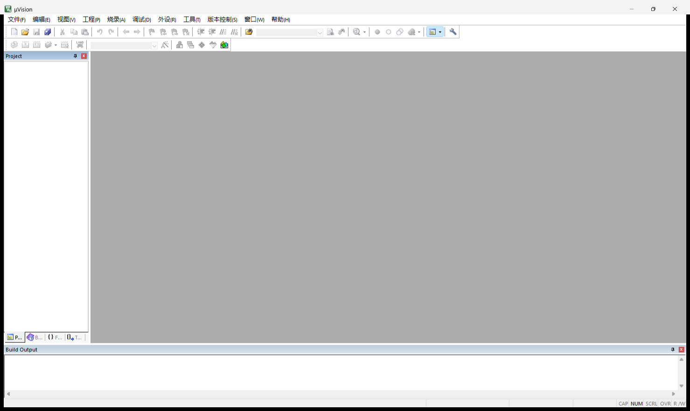
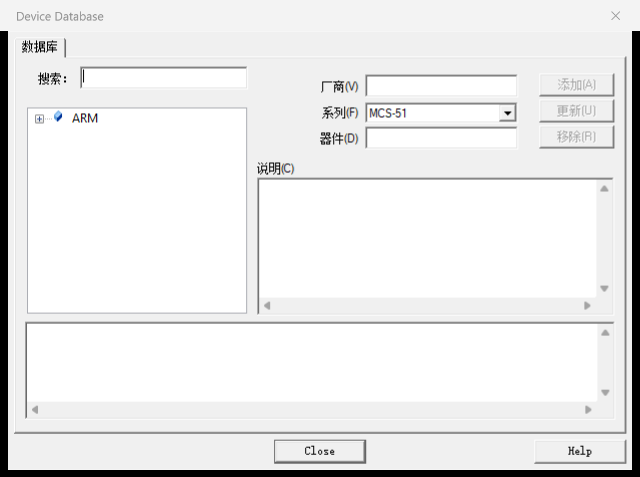
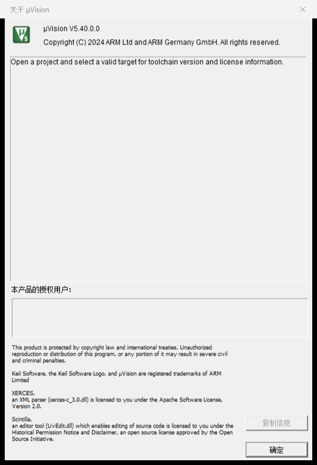

# Keil µVision 5.x 简体中文补丁（keil-zh）

高质量、可维护的 **Keil µVision（MDK / C51）界面汉化补丁**：读取你自己合法安装的官方
`UV4.exe`，就地生成一个**独立的简体中文副本 `UV4_zh-CN.exe`**。

- **不改原版**：官方 `UV4.exe` 保持原样，随时可用；
- **只改界面资源**：仅替换 PE 资源段中的字符串表、菜单、对话框文本，
  `.text / .rdata / .data` 与官方原版**逐字节一致**（可校验）；
- **一键生成 / 一键还原**，不需要重新编译、不需要解包；
- **3000+ 界面条目**：主菜单、右键菜单、工具栏提示、状态栏、绝大多数对话框。



## 效果

| 主界面 | 器件数据库 | 关于 |
|---|---|---|
|  |  |  |

实测环境：**Keil µVision 5.40.0.0**（Windows，中文系统）。

## 工作原理（一句话）

µVision 的界面文字全部保存在 `UV4.exe` 的 Win32 资源里（字符串表 `RT_STRING`、
菜单 `RT_MENU`、对话框 `RT_DIALOG`）。本补丁用官方 Windows 资源 API
把其中的英文原文**精确替换**为简体中文，生成一个中文副本；
凡是词典里没有、或原文与词典指纹不一致的条目**一律保持英文**，绝不误改。

> 只改资源、不碰代码与数据，是刻意的安全设计：即使某个词条翻错，也只影响显示，
> 不会影响编译器、调试器、Pack、工程文件或许可证逻辑。

## 环境要求

- Windows 10 / 11；
- 已合法安装 Keil µVision 5.x（自带 `UV4\UV4.exe`）；
- **Python 3.8+**（仅标准库，无需 pip 安装任何包）。

## 使用流程

### 1. 生成中文版

1. 下载本仓库（**Code → Download ZIP**）并解压到任意目录；
2. 完全退出 Keil µVision；
3. 双击 **`工具\生成中文版.cmd`**，等待出现 `output_sha256`；
4. 在 Keil 安装目录（如 `C:\Keil_v5\UV4\`）会多出一个 **`UV4_zh-CN.exe`**，双击即为中文界面。

> 脚本会自动在注册表与常见路径中查找 `UV4.exe`；找不到时可用
> `工具\生成中文版.cmd --target "D:\Keil_v5\UV4\UV4.exe"` 手动指定。

### 2. 日常使用

直接用 `UV4_zh-CN.exe` 打开工程即可；建议右键发送到桌面快捷方式。例如：

```powershell
& "C:\Keil_v5\UV4\UV4_zh-CN.exe" "D:\Projects\Demo\Demo.uvprojx"
```

### 3. 还原英文

双击 **`工具\还原英文.cmd`**：删除中文副本（如曾用原地模式，则从 `UV4.exe.bak` 恢复）。
原版 `UV4.exe` 从未被改动，也可直接继续使用原版。

### 4. 只预览、不生成

双击 **`工具\预览匹配.cmd`**，查看词典与本地 `UV4.exe` 的匹配率与未命中项。

### 5. 高级用法（命令行）

```powershell
python tools\build_patch.py                      # 自动定位并生成 UV4_zh-CN.exe
python tools\build_patch.py --dry-run            # 只统计
python tools\build_patch.py --target "<...>\UV4.exe"
python tools\build_patch.py --in-place           # 直接改写原版 UV4.exe（自动生成 .bak 备份）
python tools\verify_sections.py "<原版>" "<中文副本>"   # 校验仅资源段被改动
```

## 覆盖情况

以 µVision **5.40.0.0** 为例（见 `build/patch-report.json`）：

| 资源 | 命中 / 总数 |
| --- | --- |
| 字符串表（RT_STRING） | 828 / 955 |
| 菜单（RT_MENU） | 265 / 318 |
| 对话框（RT_DIALOG） | 2043 / 2294 |
| **合计（按出现次数）** | **3136 条** |

未命中的多为数字、寄存器名、器件型号、URL、脚本关键字等**本就不该翻译**的内容。

## 兼容性

| 版本 | 状态 |
| --- | --- |
| µVision 5.40.0.0 | ✅ 实机验证（本仓库开发环境） |
| 其它 µVision 5.x（MDK / C51） | ✅ 同机制；按“原文指纹”精确匹配，未命中项保持英文，建议先 `--dry-run` |

词典按**原文**（而非版本号）匹配，因此大版本升级后大部分词条仍然有效，只需补翻新增文案。

## 已知限制

以下内容存在于**程序代码/数据**而非资源中，无法通过资源方式翻译，保持英文：

- 「关于 µVision」对话框中的版权/许可正文（硬编码在 `.data`）；
- 少数属性表框架按钮（如「器件数据库」窗口底部的 *Close / Help*）；
- 由代码在运行时拼接或设置的个别文本（如部分窗口标题、*Recent Files*）。

这是“只改资源、不碰二进制”的必然取舍；相较于改写可执行文件，**安全与可回退更重要**。

## 目录结构

```
工具/                     一键脚本（生成中文版 / 预览匹配 / 还原英文）
tools/
  winres.py               PE 资源读写 + 菜单/对话框/字符串表格式解析
  build_patch.py          补丁生成器（核心）
  extract.py              从 UV4.exe 导出界面资源（供维护词典）
  make_catalog.py         合并 translations/src/*.json → zh_CN.json 并统计覆盖率
  make_worklists.py       生成去重后的翻译工作清单
  review.py               导出字符串/菜单/对话框清单（人工审校）
  restore.py              还原英文
  verify_sections.py      校验仅资源段被改动
translations/
  zh_CN.json              编译好的词典（补丁实际使用）
  src/*.json              词典源文件（便于审校与维护）
截图/                     效果截图
docs/                     原理、兼容性与开发验证记录
```

## 维护与二次开发

- 修正某个词条：编辑 `translations/src/*.json` 中对应的“英文原文 → 中文”，
  运行 `python tools\make_catalog.py` 重新生成 `translations/zh_CN.json`；
- 补翻新版本新增文案：`python tools\extract.py "<...>\UV4.exe"` →
  `python tools\make_worklists.py` → 参考 `build/coverage.txt` 补全；
- 词典支持**按上下文覆盖**：`translations/src/_overrides.json` 可对
  特定对话框控件 / 菜单项做定向翻译（键为 `dialog:资源号:item:控件号` 等）。

## 版权与免责声明

- 本仓库**不提供** Keil 软件本体、`UV4.exe`、编译器、Pack、许可证或注册机；
  也不分发任何修改后的二进制——中文副本由使用者**在自己机器上**生成。
- Keil、µVision、MDK、ARM 是 Arm Limited / Keil 的商标；请通过官方渠道获取并使用正版软件。
- 本项目为第三方非官方汉化，与 Arm / Keil 无任何关联。
- 工具与词典：MIT（见 `LICENSE`）；使用本项目产生的一切后果由使用者自行承担。
